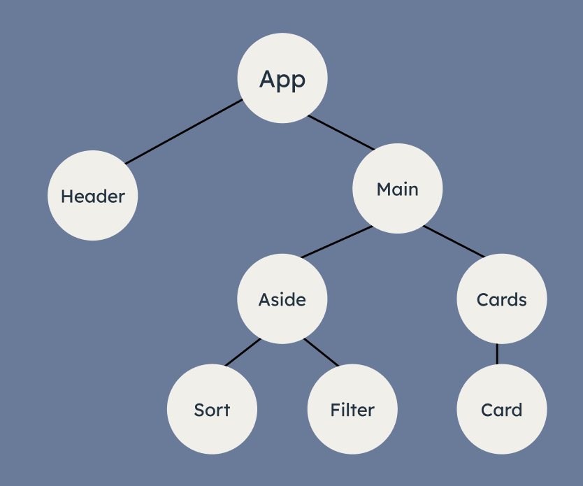
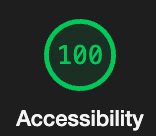
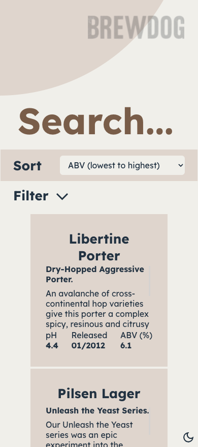
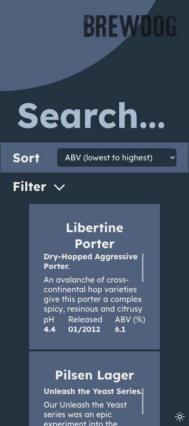
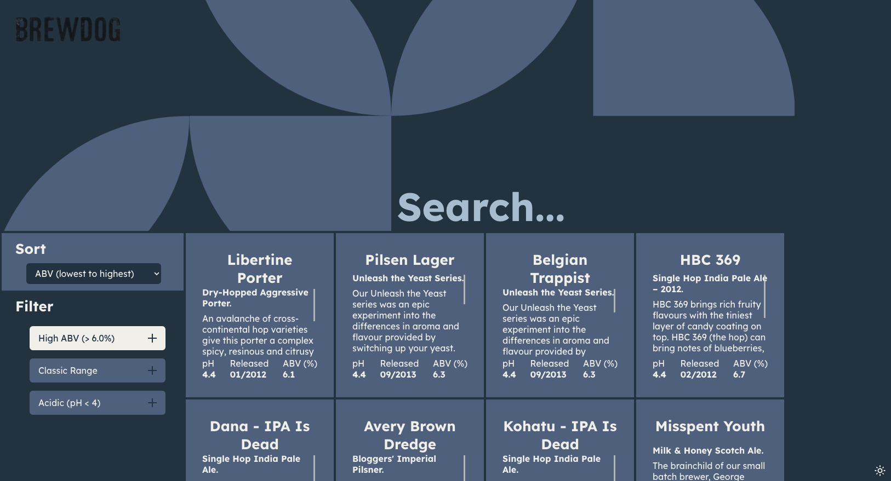

# Punk API Project

  

## Project

The aim of this project was to further knowledge of React and React integration with an API. The task was to create a responsive page that enables users to search, filter, and sort through beers and respective details. The data about the beers was obtained from an the Punk API (link below).

https://punkapi.com/

## Design Approach

  

_Component Tree of Punk API Project_

Data was fetched from the API. An error handling method was integrated to deal with errors that may be thrown by the API (i.e. searching for a beer that does not exist in the database).

The useEffect and useState hooks were employed to achieve dynamic performance from the website.

Inputs were used for all interactive elements so that the user can interact entirely without a mouse if necessary.

Toggling filters, performing searches, and sorting results led to state changes that were used as the dependencies of a useEffect hook, allowing the page to update the API request and in turn the data displayed on screen.

A light and dark mode was integrated, allowing the users to adjust the websites visuals at the click of a button.

Lighthouse was used to assess the accessibility of the website. Colours were adjusted and other accessibility requirements, such as giving all form elements a label (though visibly hidden for the search), were met for all combinations of the light, dark, mobile, and desktop versions of the website.

  

React tests were written and used to assert correct performance of the website.

## Links to Project

### Deployed Site

https://samueljacobs98.github.io/punk-api-project/

### GitHub Repo

https://github.com/samueljacobs98/punk-api-project

### Figma Design

https://www.figma.com/file/I2gQl7iNKwmuSa6vJzB597/Punk-API?node-id=0%3A1

## Images

  
  
  
  
